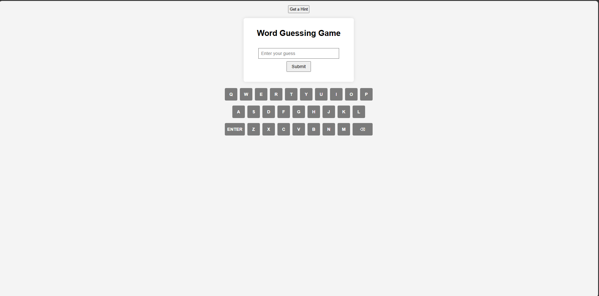

# 🎮 Word Guessing Game

A **Wordle-inspired** word guessing game built with pure HTML, CSS, and JavaScript. Challenge yourself to guess the hidden 5-letter computer-themed word within 5 attempts!



---

## 📖 About

This is a browser-based word guessing game where players try to guess a hidden 5-letter word related to **computer science and technology**. After each guess, the game provides color-coded feedback to help guide the player toward the correct answer — just like the popular game Wordle!

---

## ✨ Features

- 🟩 **Color-Coded Feedback** — Green for correct letter & position, Yellow for correct letter but wrong position, Gray for incorrect letters
- ⌨️ **On-Screen Keyboard** — Click letters directly on the virtual QWERTY keyboard
- 💡 **Hint System** — Stuck? Click "Get a Hint" for a clue about the word
- ✅ **Word Validation** — Guesses are validated against a real English dictionary API to ensure only valid words are accepted
- 🔄 **Restart Option** — A "Try Again!" button appears when the game ends, allowing you to play again with a new word
- 🖥️ **Computer-Themed Words** — All words are related to programming and technology (e.g., `STACK`, `ARRAY`, `DEBUG`, `CACHE`)

---

## 🎯 How to Play

1. **Type a 5-letter word** using your keyboard or the on-screen keyboard
2. **Click Submit** (or press ENTER) to submit your guess
3. **Read the color feedback:**
   - 🟩 **Green** — The letter is correct and in the right position
   - 🟨 **Yellow** — The letter is in the word but in the wrong position
   - ⬜ **Gray** — The letter is not in the word
4. **Use the hints** if you need help — click the "Get a Hint" button
5. **Guess the word within 5 attempts** to win!

---

## 🛠️ Tech Stack

| Technology | Purpose |
|------------|---------|
| **HTML5** | Page structure and layout |
| **CSS3** | Styling, grid layout, and animations |
| **JavaScript** | Game logic, DOM manipulation, and API calls |
| **Dictionary API** | Validates that guesses are real English words |
| **JSON** | Stores the word list with hints |

---

## 📁 Project Structure

```
2D-HTML-GAME-Project-main/
├── index.html      # Main HTML page
├── style.css       # Stylesheet for the game UI
├── script.js       # Game logic and event handling
├── words.json      # Word list with hints (20 computer-themed words)
├── img/
│   └── 2dgame.png  # Game screenshot
└── README.md       # Project documentation
```

---

## 🚀 Getting Started

1. **Clone the repository**
   ```bash
   git clone https://github.com/your-username/2D-HTML-GAME-Project-main.git
   ```

2. **Open the game**
   - Simply open `index.html` in any modern web browser
   - No build tools or dependencies required!

3. **Start playing!**
   - Type your guess and click Submit

> **Note:** An internet connection is required for the word validation feature (Dictionary API).

---

## 📝 Word List

The game includes **20 computer science-themed words**, each with a custom hint:

| Word | Hint |
|------|------|
| DRIVE | For storing computer information |
| BYTES | A unit of computer information |
| STACK | A way of storing data (LIFO) |
| ARRAY | A series of memory locations sharing the same name |
| DEBUG | To remove bugs from software |
| CACHE | Temporary fast-access memory |
| ... | *and more!* |

---

## 📜 License

This project is open source and available for educational purposes.

---

> Built with ❤️ using vanilla HTML, CSS, and JavaScript
